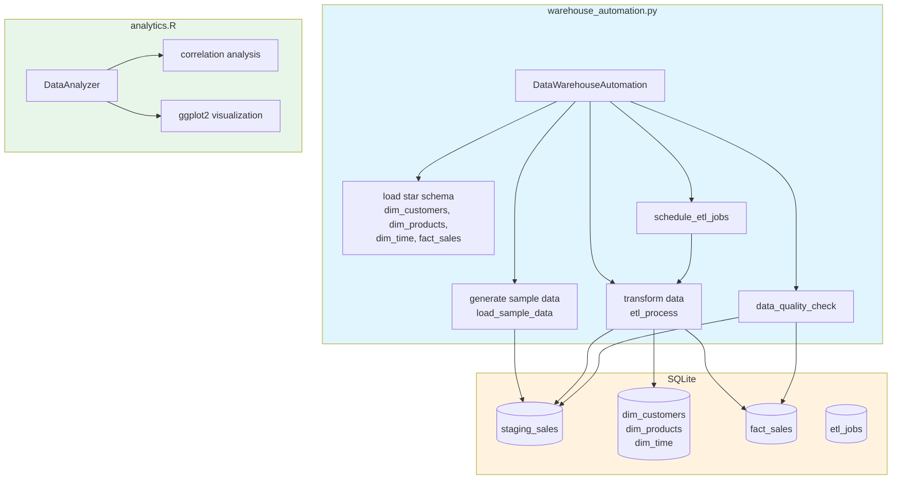

# Data-Warehouse-Automation

<div align="center">


[](Dockerfile)

</div>


[Portugues](#portugues) | [English](#english)

---

## Portugues

### Descricao

Sistema de automacao de data warehouse com pipeline ETL usando SQLite e pandas. Gera dados de exemplo de varejo, transforma (joins, agregacoes), carrega em esquema estrela SQLite e oferece um dashboard web Flask para visualizacao de metricas.

### O que este projeto faz

- Pipeline ETL que gera dados de amostra de varejo (clientes, produtos, vendas)
- Transforma dados via joins e agregacoes
- Carrega em esquema estrela SQLite (tabelas dimensao e fato)
- Verificacoes de qualidade de dados (nulos, duplicatas)
- Agendamento de jobs ETL usando a biblioteca `schedule`
- Modulo complementar de analytics em R (analise estatistica e visualizacao com ggplot2)

### O que este projeto NAO possui

- Processamento paralelo
- Configuracao via YAML/JSON
- Sistema de alertas
- Containerizacao (Docker)
- CI/CD
- Testes abrangentes (os testes existentes apenas verificam a existencia de arquivos)

### Stack Tecnologica

| Tecnologia | Papel |
|------------|-------|
| Python | Linguagem principal (~486 linhas) |
| SQLite | Banco de dados do data warehouse |
| pandas | Transformacao de dados |
| schedule | Biblioteca de agendamento |
| R | Analytics complementar (~62 linhas) |
| ggplot2 | Visualizacao de dados (R) |

### Arquitetura


### Como Executar

```bash
# Instalar dependencias
pip install -r requirements.txt

# Executar o pipeline ETL
python warehouse_automation.py
```

### Estrutura do Projeto

```
Data-Warehouse-Automation/
├── warehouse_automation.py   # Pipeline ETL principal (~486 linhas)
├── analytics.R               # Analytics complementar em R (~62 linhas)
├── requirements.txt          # Dependencias Python
├── tests/
│   └── test_main.R           # Testes scaffold (apenas verificacao de existencia de arquivos)
├── .gitignore
├── LICENSE
└── README.md
```

### Testes

Os testes em `tests/test_main.R` sao testes scaffold em R que apenas verificam se arquivos existem (README.md, LICENSE). Nao ha testes unitarios ou de integracao para o pipeline ETL em Python.

---

## English

### Description

Data warehouse automation system with an ETL pipeline using SQLite and pandas. Generates sample retail data, transforms it (joins, aggregations), loads into a SQLite star schema, and provides a Flask web dashboard for viewing metrics.

### What this project does

- ETL pipeline that generates sample retail data (customers, products, sales)
- Transforms data via joins and aggregations
- Loads into SQLite star schema (dimension and fact tables)
- Data quality checks (nulls, duplicates)
- ETL job scheduling using the `schedule` library
- Supplementary R analytics module (statistical analysis and ggplot2 visualization)

### What this project does NOT have

- Parallel processing
- YAML/JSON configuration
- Alerting system
- Containerization (Docker)
- CI/CD
- Comprehensive testing (existing tests only check file existence)

### Tech Stack

| Technology | Role |
|------------|------|
| Python | Primary language (~486 lines) |
| SQLite | Data warehouse database |
| pandas | Data transformation |
| schedule | Scheduling library |
| R | Supplementary analytics (~62 lines) |
| ggplot2 | Data visualization (R) |

### Architecture



### How to Run

```bash
# Install dependencies
pip install -r requirements.txt

# Run the ETL pipeline
python warehouse_automation.py
```

### Project Structure

```
Data-Warehouse-Automation/
├── warehouse_automation.py   # Main ETL pipeline (~486 lines)
├── analytics.R               # Supplementary R analytics (~62 lines)
├── requirements.txt          # Python dependencies
├── tests/
│   └── test_main.R           # Scaffold tests (file-existence checks only)
├── .gitignore
├── LICENSE
└── README.md
```

### Tests

The tests in `tests/test_main.R` are scaffold R tests that only check whether files exist (README.md, LICENSE). There are no unit or integration tests for the Python ETL pipeline.

---

### Author

**Gabriel Demetrios Lafis**
- GitHub: [@galafis](https://github.com/galafis)
- LinkedIn: [Gabriel Demetrios Lafis](https://linkedin.com/in/gabriel-demetrios-lafis)

### License

This project is licensed under the MIT License - see the [LICENSE](LICENSE) file for details.
